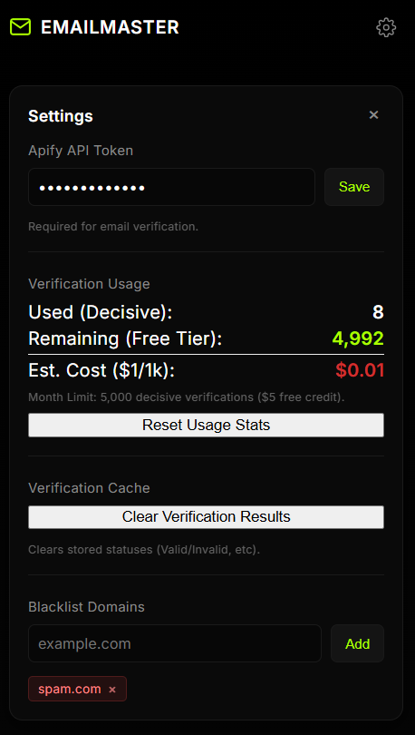
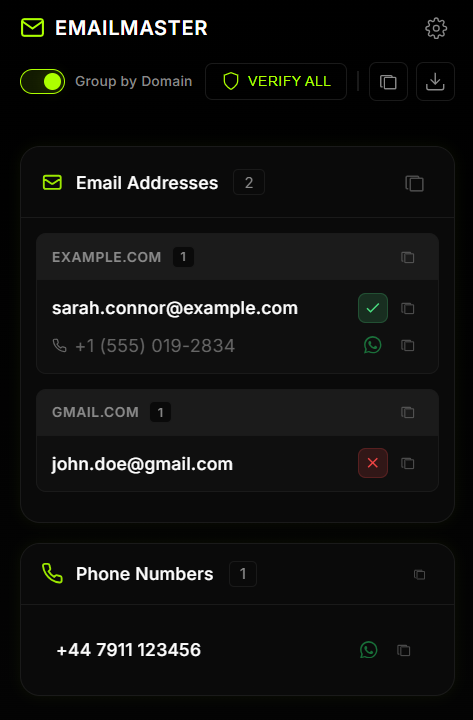

# Email & Phone Number Extractor

A powerful Chrome Extension designed to scrape, organize, and manage contact information (Emails and Phone Numbers) from any website in real-time. It features intelligent grouping logic to associate phone numbers with their corresponding emails based on page layout, along with loose phone number detection and robust blacklist management.

## 🚀 Key Features

### 1. **Live Data Detection**
- **Real-time Badge**: The extension icon displays a live counter of unique emails found on the current page.
- **Smart Updates**: The count updates instantly as you scroll or as new content loads (e.g., infinite scrolling feeds).
- **Blacklist Aware**: The badge count ignores emails from domains you have blacklisted.

### 2. **Intelligent Grouping & Association**
- **Contextual Linking**: The extension doesn't just find emails; it scans the surrounding HTML structure to find phone numbers visually associated with that email.
- **Grouped Display**: Emails and their linked phone numbers are displayed together.
- **Unconnected Numbers**: Phone numbers found on the page that *aren't* near an email are listed separately in a "Phone Numbers" section to ensure no data is missed.

### 3. **Advanced Copy & Export**
- **Custom Formatting**: Copies data in the specific format: `email : : number` (stripping leading `+` signs from numbers).
- **One-Click Copy**:
  - **Copy All**: Copies every email and number found.
  - **Copy Group**: Copies a specific domain group.
  - **Copy Individual**: Copy just the email or just the phone number.
- **WhatsApp Integration**: Every extracted phone number has a **Chat on WhatsApp** icon. Clicking it opens a direct chat window with that number (automatically sanitized for the API).

### 4. **Blacklist System**
- **Domain Blocking**: Built-in Settings panel to add/remove domains (e.g., `example.com`).
- **Persistence**: Blacklist settings are saved locally and persist across sessions.
- **Active Filtering**: Adding a domain immediately removes those emails from the list and updates the badge count.

### 5. **Modern UI/UX**
- **Dark Mode**: Sleek, neon-accented dark theme.
- **Glassmorphism**: Modern UI elements with blur effects.
- **Responsive Text**: Handles long email addresses gracefully with smart wrapping.

---

## 🛠️ Installation

1. **Clone/Download** this repository.
2. Open Chrome and navigate to `chrome://extensions/`.
3. Enable **Developer Mode** (toggle in the top right).
4. Click **Load unpacked**.
5. Select the folder containing this project.

---

## 📖 Usage Guide

### The Interface
- **Top Bar**:
  - **Settings (Gear Icon)**: Opens the Blacklist panel.
  - **Toggle**: Switch between "Grouped by Domain" view or a flat list.
  - **Copy All Button**: Copies all extraction data to your clipboard.
- **Email Addresses Section**:
  - Lists found emails.
  - If a phone number was found nearby in the page, it appears directly under the email.
- **Phone Numbers Section**:
  - Lists "Loose" phone numbers that were found on the page but could not be confidently linked to a specific email.

### Blacklisting Domains
1. Click the **Gear Icon** ⚙️ in the header.
2. Type a domain (e.g., `gmail.com` or `google.com`).
3. Click **Add**.
4. Extracted data from that domain will instantly be hidden.

### Copying & Actions
- **Copy**: Click the square icon next to any item.
  - *Format*: `user@example.com : : 1234567890`
- **WhatsApp**: Click the WhatsApp logo next to a phone number.
  - *Action*: Opens `https://api.whatsapp.com/send/?phone=...`

---

## 💻 Tech Stack
- **Manifest V3**: Compliant with the latest Chrome Extension standards.
- **JavaScript (Vanilla)**: Lightweight and fast execution.
- **CSS3**: Custom variables and advanced Flexbox layouts.
- **Chrome APIs**:
  - `chrome.runtime`: Message passing.
  - `chrome.storage`: Saving blacklist settings.
  - `chrome.action`: Updating the icon badge.

## 🔒 Permissions
- `activeTab`: To read the DOM of the current tab when the popup is opened.
- `storage`: To save your settings (toggle state and blacklist).
- `scripting`: To inject the extraction logic.
